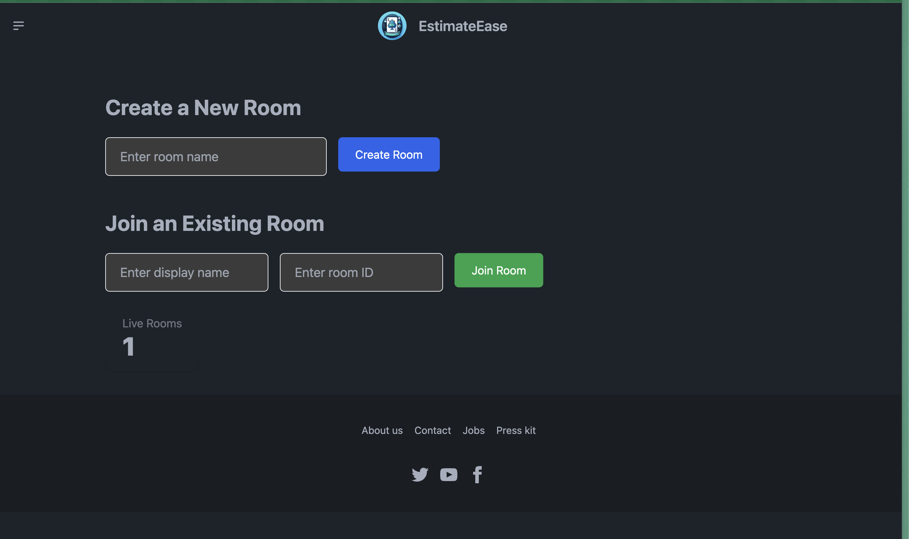
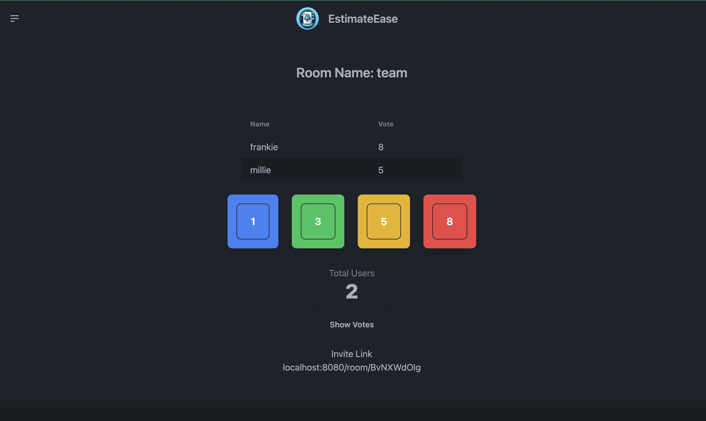

# Project EstimateEase

EstimateEase is a web application that allows users to estimate the time it will take to complete a task. It uses websockets to communicate with the server and client




## Tech Stack

- **Server**: _Go_, chi, gorilla/websockets
- **Frontend**: DaisyUI, HTMX, templ

## Getting Started

These instructions will get you a copy of the project up and running on your local machine for development and testing purposes. See deployment for notes on how to deploy the project on a live system.

## CI-CD
Application is built and deployed on pushes to main via Google Cloud Run 


## MakeFile

```bash
make all build
```

build the application

```bash
make build
```

run the application

```bash
make run
```

live reload the application

```bash
make watch
```

run the test suite

```bash
make test
```

clean up binary from the last build

```bash
make clean
```

## Contributions

- Any and all contributions welcome, feel free to reach out
